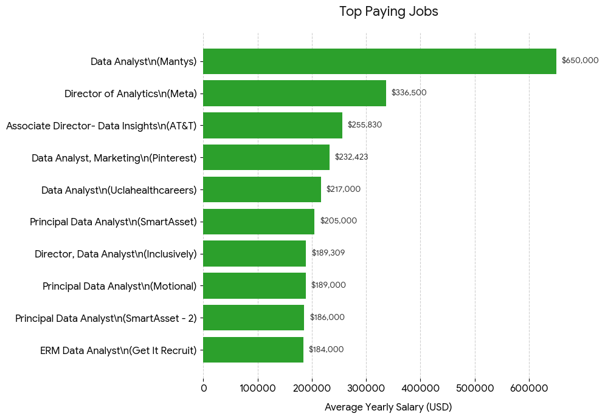
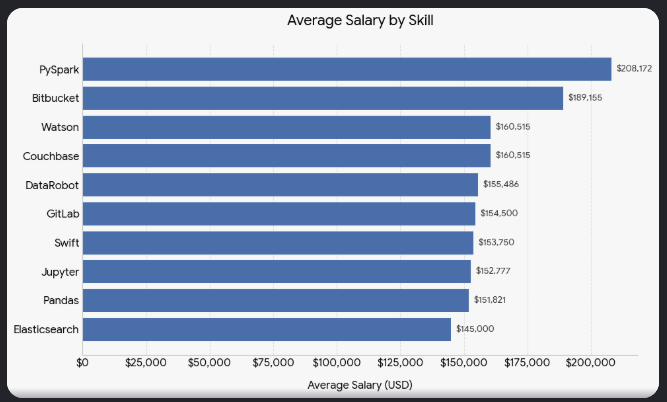
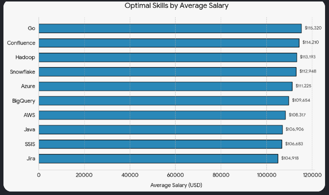

# SQL_Data_Job_Analysis_Project
Answering the ultimate job hunter's questions: Where are the highest-paying remote Data Analyst roles, and what specific skills command top dollar? Data-backed insights and visualizations built to optimize your career strategy.


# Introduction
This project explores the data analyst job market to uncover the most lucrative and strategic career paths. By analyzing job postings, salaries, and required skill sets, this analysis answers five core questions to help data professionals navigate the industry:

1. **What are the top-paying data analyst jobs?**
2. **What skills are required for these top-paying roles?**
3. **What are the most in-demand skills for data analysts?**
4. **What skills are associated with the highest average salaries?**
5. **What are the most optimal skills to learn (high demand *and* high pay)?**

The goal is to provide data-driven insights for aspiring analysts, career changers, and remote job seekers looking to maximize their value in the current tech economy.


# Background

The tech landscape is shifting rapidly, with remote and hybrid roles becoming highly sought after by data professionals. To navigate this evolving market, I wanted to dive into a massive dataset of job postings rather than relying on guesswork or hype. 

This project was born out of a need to use actual data to find out which skills truly give data analysts the highest return on investment (ROI) for their time, training, and career development.

# Tools I Used

To handle this large-scale dataset and extract meaningful insights, I used the following tools:

* **SQL:** The backbone of the project, used for querying the database, filtering roles, and aggregating salary and skill data.
* **PostgreSQL:** The database management system chosen to host and manage the massive job dataset.
* **Visual Studio Code:** My primary environment for writing clean SQL queries and managing project files.
* **Git & GitHub:** Used for version control and sharing this analysis with the data community.

# The Analysis

### 1. What are the top-paying data analyst jobs?
To identify the highest-paying opportunities, I filtered data analyst roles by average yearly salaries, focusing specifically on remote ('Anywhere') positions with specified salaries. This query highlights the top 10 highest-earning opportunities in the field, helping professionals target high-value companies and roles.

```sql
SELECT 
    job_id,
    job_title,
    job_location,
    job_schedule_type,
    salary_year_avg,
    job_posted_date,
    name AS company_name
FROM
    job_postings_fact
LEFT JOIN company_dim ON job_postings_fact.company_id = company_dim.company_id
WHERE
    job_title_short = 'Data Analyst' AND
    job_location = 'Anywhere' AND
    salary_year_avg IS NOT NULL
ORDER BY
    salary_year_avg DESC
LIMIT 10;
```




### 2. What skills are required for these top-paying roles?
By leveraging a Common Table Expression (CTE) to isolate the top 10 highest-paying remote data analyst jobs, this query joins those listings against the skills dimensions. This reveals the specific technical competencies and tools required to command top-tier salaries in the remote job market.

```sql
WITH top_paying_jobs AS (
    SELECT 
        job_id,
        job_title,
        salary_year_avg,
        name AS company_name
    FROM
        job_postings_fact
    LEFT JOIN company_dim ON job_postings_fact.company_id = company_dim.company_id
    WHERE
        job_title_short = 'Data Analyst' AND
        job_location = 'Anywhere' AND
        salary_year_avg IS NOT NULL
    ORDER BY
        salary_year_avg DESC
    LIMIT 10
)

SELECT top_paying_jobs.*, 
       skills
FROM top_paying_jobs
INNER JOIN skills_job_dim on top_paying_jobs.job_id = skills_job_dim.job_id
INNER JOIN skills_dim on skills_job_dim.skill_id = skills_dim.skill_id
ORDER BY
    salary_year_avg DESC;
```




### 3. What are the most in-demand skills for a data analyst?
To understand what skills keep an analyst highly marketable, I aggregated the total volume of job postings demanding specific tools. This query focuses strictly on data analyst roles with remote options ('job_work_from_home = TRUE') to reveal the top 5 most frequently requested competencies.

```sql
SELECT 
    skills,
    COUNT(skills_job_dim.job_id) AS demand_count 
FROM job_postings_fact
INNER JOIN skills_job_dim ON job_postings_fact.job_id = skills_job_dim.job_id
INNER JOIN skills_dim ON skills_job_dim.skill_id = skills_dim.skill_id
WHERE
    job_title_short = 'Data Analyst' AND
    job_work_from_home = TRUE
GROUP BY 
    skills
ORDER BY 
    demand_count DESC
LIMIT 5;
```

| Skills | Demand Count |
| :--- | :--- |
| SQL | 7,291 |
| Excel | 4,611 |
| Python | 4,330 |
| Tableau | 3,745 |
| Power BI | 2,609 |


### 4. What are the top paying skills based on salary?
Different skills command different premiums. This query looks at the average salaries associated with specific tools and languages, revealing the top 10 specialized skills that offer the highest financial reward for remote Data Analysts.

```sql
SELECT
    skills,
    ROUND(AVG(salary_year_avg), 0) AS avg_salary
FROM job_postings_fact
INNER JOIN skills_job_dim ON job_postings_fact.job_id = skills_job_dim.job_id
INNER JOIN skills_dim ON skills_job_dim.skill_id = skills_dim.skill_id
WHERE 
    job_title_short = 'Data Analyst' AND 
    salary_year_avg IS NOT NULL
    AND job_work_from_home = TRUE
GROUP BY 
    skills
ORDER BY 
    avg_salary DESC
LIMIT 10;
```


### 5. What are the most optimal skills to learn?
To identify the ultimate "sweet spot," this query combines demand volume and average salary data. By applying a `HAVING` filter to ensure the tools appear in more than 10 postings, this analysis eliminates low-volume anomalies and isolates the top 10 most optimal, high-value skills to master for a strong return on investment (ROI).

```sql
SELECT
    skills_dim.skill_id,
    skills_dim.skills,
    COUNT(skills_job_dim.job_id) AS demand_count,
    ROUND(AVG(job_postings_fact.salary_year_avg), 0) AS avg_salary
FROM job_postings_fact
INNER JOIN skills_job_dim ON job_postings_fact.job_id = skills_job_dim.job_id
INNER JOIN skills_dim ON skills_job_dim.skill_id = skills_dim.skill_id
WHERE 
    job_title_short = 'Data Analyst' 
    AND salary_year_avg IS NOT NULL 
    AND job_work_from_home = TRUE
GROUP BY 
    skills_dim.skill_id
HAVING    
    COUNT(skills_job_dim.job_id) > 10
ORDER BY 
    avg_salary DESC,
    demand_count DESC
LIMIT 10;
```




# What I Learned

Through this project, I significantly advanced my technical database capabilities while gaining deep, data-driven perspective into the employment market. Here are the core takeaways from this analysis:

* **Advanced SQL Querying Mastered:** I grew from writing simple queries to crafting complex data pipelines. I successfully implemented multi-table `INNER JOINs`, `LEFT JOINs`, and Common Table Expressions (`CTEs`) to isolate target data profiles.
* **Data Cleansing & Filtering Strategy:** I learned the real-world value of filtering out anomalies using `salary_year_avg IS NOT NULL` and using the `HAVING` clause to set cut-offs (`COUNT(job_id) > 10`), effectively removing statistical outliers and keeping the data clean.
* **Economic Skill Strategy:** I discovered how to distinguish between a skill that is popular (high demand, like Excel) versus a skill that is highly lucrative (high salary), allowing for a much more strategic approach to skill prioritization.
* **Real-World Problem Solving:** This project showed me how to transform a vague career question into an exact, reproducible data query to back up market assumptions with objective facts.


# Conclusion

This project serves as a strategic roadmap for navigating the Data Analyst job market. By analyzing real-world job posting data, several critical paths to career success become clear:

* **Maximize Your Baseline Marketability:** Foundational tools like **SQL** and **Python** remain non-negotiable for securing volume and visibility in the job market, as they dominate overall employer demand.
* **Aim for the "Sweet Spot":** To achieve the best return on investment, analysts should focus on **optimal skills**—technologies that sit comfortably at the intersection of high industry demand and premium salaries, filtered to ensure stable market volume.
* **Filter Out the Noise:** The data proves that true insight comes from strategic refinement. Eliminating statistical outliers and targeting specific workspace profiles (like remote 'Anywhere' listings) yields much more actionable career data.

Ultimately, data shows that success in the current tech landscape isn't just about learning *more* tools—it is about learning the **right** tools. By backing up career development choices with data-driven insights, aspiring and remote data analysts can strategically position themselves to maximize both their career opportunities and earning potential.


